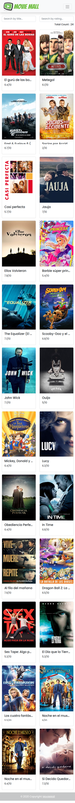

# MovieMall

    

# Follow these steps to run this project in localhost

Open your terminal and type these:
1. `git clone https://github.com/tuntunpandit/MovieMall.git`
2. `npm install`
3. `ng serve -o`

## Live Demo : <a href="https://movie-mall.vercel.app/">Click Here!</a>
# Screeshots

1. **Desktop View**
    

      
    

2. **Mobile View**
    

      
    

